# Rate limiter Vs Buckets

How do you stop someone from guessing passwords on a login API? You limit how many attempts each user gets. This project explains the two classic ways to do that, shows where the simple one breaks, and lets you watch all of it happen in a terminal.

The short version:

- A **fixed window counter** is the simplest rate limiter, and it can be tricked into allowing **twice the limit in about 2 seconds**.
- A **token bucket** closes that hole because nothing ever resets all at once.
- With more than one server, the limiter's state has to live in **shared storage such as Redis**, or every extra server quietly raises the limit.

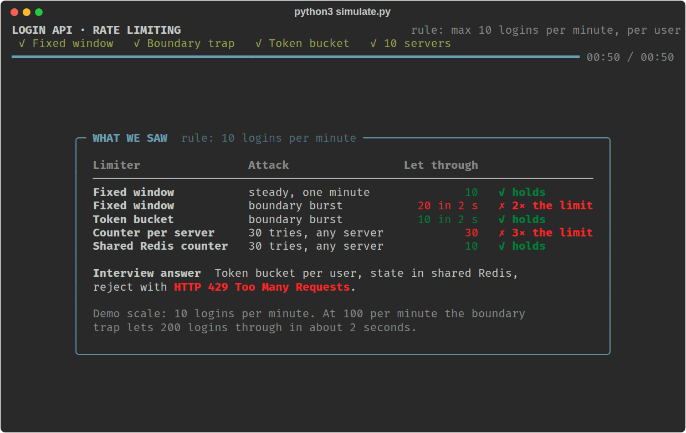

## Contents

- [Run the simulation](#run-the-simulation)
- [The problem](#the-problem)
- [Fixed window counter](#fixed-window-counter)
- [The boundary problem](#the-boundary-problem)
- [Token bucket](#token-bucket)
- [More than one server](#more-than-one-server)
- [Side by side](#side-by-side)
- [The simulation, screen by screen](#the-simulation-screen-by-screen)
- [Options](#options)
- [What the simulation simplifies](#what-the-simulation-simplifies)
- [The interview answer](#the-interview-answer)
- [Files](#files)

## Run the simulation

```bash
pip install rich
python3 simulate.py
```

You need Python 3 (tested on 3.12) and a terminal of at least 80 columns by 24 rows. The show plays four acts. After each one it stops on a summary and waits for you to press Enter.

## The problem

A login API takes an email and a password. Nothing stops an attacker from sending a different password for the same email again and again until one works. This is a **brute-force attack**.

A **rate limiter** is the guard in front of the API. It counts login attempts per user. Once a user goes over the limit, the request is rejected before the password is even checked, and the server answers:

**HTTP 429 Too Many Requests**

```text
Attacker ──▶ Rate limiter ──▶ Login API
                  │
                  ▼ over the limit?
          429 Too Many Requests
```

The question is how the guard should count. The examples below use a limit of **100 logins per minute per user**. The simulation uses **10 per minute** so that every single request stays visible on screen; the logic is identical.

## Fixed window counter

The simplest design keeps one counter per user and wipes it every minute.

1. Keep a counter for every user.
2. Add 1 whenever a login arrives.
3. If the counter has reached the limit, reject the request with 429.
4. When a new minute starts, reset the counter to 0.

```text
User → Login request
          ↓
     Check counter
          ↓
   Is count < 100?
      /        \
    Yes         No
     ↓           ↓
   Allow      Reject
  request    HTTP 429
```

This is the limiter as the simulation runs it (docstring trimmed):

```python
@dataclass
class FixedWindow:
    limit: int = LIMIT
    window_sec: int = WINDOW
    count: int = 0
    window: int = 0

    def roll(self, now: float) -> None:
        window = int(now // self.window_sec)
        if window != self.window:
            self.window, self.count = window, 0

    def allow(self, now: float) -> bool:
        self.roll(now)
        if self.count >= self.limit:
            return False
        self.count += 1
        return True
```

**Why people use it.** It is simple and cheap: one number per user and one comparison per login.

**The catch.** The whole allowance comes back in a single instant, at the minute boundary. An attacker can aim for that instant.

## The boundary problem

The counter only knows which minute it is in. It has no memory of how recently the previous requests arrived.

So with a limit of 100 per minute, an attacker can:

1. Send 100 requests in the **59th second** of a minute. The counter reaches 100 and all of them are allowed.
2. Wait one second. A new minute starts and the counter resets to 0.
3. Send another 100 requests in the **first second** of the new minute. All of them are allowed too.

```text
Minute 1                                  Minute 2
──────────────────────────────────────┬──────────────────────────────────────
                         59th second  │  1st second
                      → 100 requests  │  → counter resets to 0
                      → counter = 100 │  → another 100 requests
                      → all allowed   │  → all allowed

                 Total: 200 requests in about 2 seconds
```

The rule said 100 per minute. The attacker got 200 in about 2 seconds, and each burst looked legal on its own. A fixed window can let through up to **twice the limit** around every boundary. This is the **fixed window boundary problem**.

## Token bucket

A token bucket never resets. Each user has a bucket of tokens, and tokens come back gradually.

- The bucket holds at most **100 tokens**.
- Every login takes **1 token** out.
- If there is a token, the request is allowed.
- If the bucket is empty, the request is rejected with 429.
- Tokens are added back continuously at a fixed rate.

The refill rate is the limit spread evenly over the window:

```text
100 tokens / 60 seconds ≈ 1.67 tokens per second
                        ≈ 1 token every 0.6 seconds
```

```text
            Token refill
                 ↓
       ┌─────────────────┐
       │   Token bucket  │
       │  100 99 98 ...  │
       └────────┬────────┘
                │
         Request arrives
                │
        Is a token available?
           /            \
         Yes             No
          ↓               ↓
    Take a token       Reject
          ↓           HTTP 429
    Allow request
```

The limiter in the simulation (docstring and one comment trimmed):

```python
@dataclass
class TokenBucket:
    capacity: int = LIMIT
    refill_per_sec: float = LIMIT / WINDOW
    tokens: float = float(LIMIT)
    updated: float = 0.0

    def refill(self, now: float) -> None:
        gained = (now - self.updated) * self.refill_per_sec
        self.tokens = min(self.capacity, self.tokens + gained)
        self.updated = now

    def allow(self, now: float) -> bool:
        self.refill(now)
        if self.tokens < 1 - EPS:
            return False
        self.tokens = max(0.0, self.tokens - 1)
        return True
```

Notice there is no timer adding tokens in the background. The bucket stores two values per user, **tokens left** and **the time of the last refill**, and works out how many tokens came back whenever a request arrives.

**Why it holds against the boundary attack.** Run the same attack: 100 requests in the 59th second empty the bucket. Two seconds later only about 3 tokens have dripped back, so the second burst of 100 gets about 3 through instead of 100. There is no special moment to aim for.

**What it still allows.** A full bucket can be spent in one burst, so a user who has been idle can send 100 requests at once. That is intended: the burst is capped at the bucket size, and after it the user is held to the refill rate. If bursts of that size are a problem, make the bucket smaller than the per-minute rate.

## More than one server

Real applications run on many servers behind a load balancer. Suppose there are 10, and each keeps the limiter in its own memory:

```text
Server 1  → counter = 50
Server 2  → counter = 30
Server 3  → counter = 20
...
Server 10 → counter = 10
```

The load balancer spreads one user's logins across all of them. Each server counts only the requests it happened to receive, so each one thinks the user is well under the limit. The real limit becomes the limit multiplied by the number of servers: 100 per minute turns into 1,000.

The fix is to keep the limiter's state in one place that every server reads and writes:

```text
                         ┌── Server 1 ──┐
                         │              │
                         ├── Server 2 ──┤
                         │              │
User → Load balancer ────┼── Server 3 ──┼──→ Redis
                         │              │
                         ├── ... ───────┤
                         │              │
                         └── Server 10 ─┘
```

Now it does not matter which server receives a login. They all see the same count.

**Why Redis is a good fit**

- It keeps data **in memory**, so the extra lookup on every login is very fast.
- It has **atomic operations**. Two servers handling the same user at the same instant cannot both read the old value and both allow the request. A counter can use `INCR`; a token bucket's read-refill-take sequence is usually wrapped in a small Lua script so it runs as one step.
- **Every server can reach it**, which is the whole point.
- It supports **expiry (TTL)**, so state for users who stopped logging in is cleaned up automatically.
- It can store everything a token bucket needs per user: the token count and the last refill timestamp.

## Side by side

| | Fixed window counter | Token bucket |
|---|---|---|
| State per user | One counter | Tokens left, time of last refill |
| How the allowance returns | All at once, when the window ends | Gradually, at a fixed rate |
| Worst case around a boundary | 2× the limit in about 2 seconds | No boundary; a burst is capped at the bucket size |
| Complexity | Very simple | Slightly more logic, still cheap |
| Works across many servers | Only with shared state | Only with shared state |

## The simulation, screen by screen

`simulate.py` runs the two limiters shown above against scripted attacks and draws what happens. Nothing on screen is faked: every `200 OK` and `429` is the return value of `allow()`.

The rule in the demo is **10 logins per minute per user**.

### The screen

Every act uses the same layout:

- **Top:** the rule, which of the four acts is playing, and a progress bar.
- **Caption:** one sentence saying what is happening right now.
- **Left panel:** the limiter's internal state.
- **Right panel:** each login as it arrives, marked `✓ 200 OK` or `✗ 429`.
- **Bottom:** how many logins were allowed and blocked, and a verdict when the act ends. A green border means the limit held; red means it was beaten.

### Intro: the problem

The show opens with the three players: the attacker, the rate limiter and the login API.

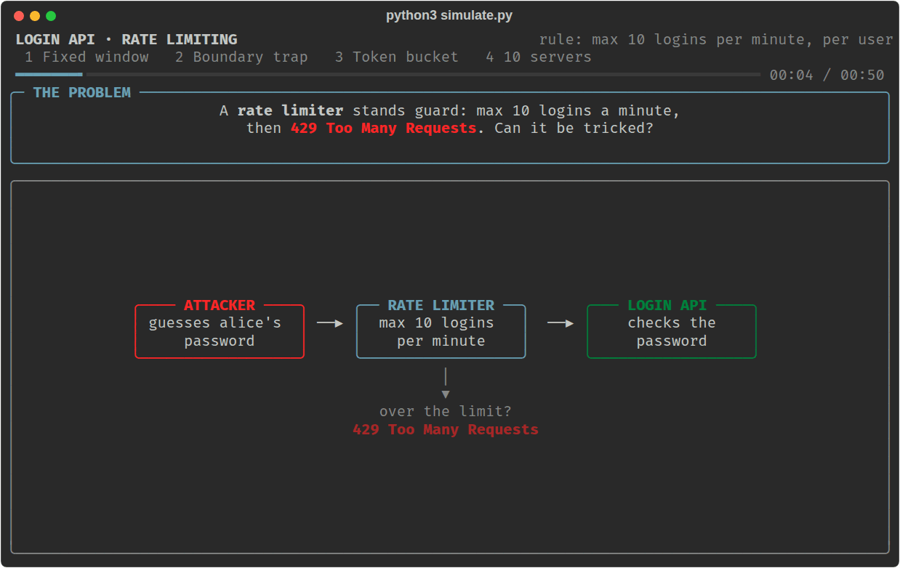

### Act 1: the fixed window does its job

The attacker sends 11 logins inside one minute, one per second. The counter fills one square per login. The first 10 are allowed, and number 11 is rejected with 429.

The timeline shows two minutes side by side; the bars are where the logins landed. The green bar at the bottom counts logins that got through.

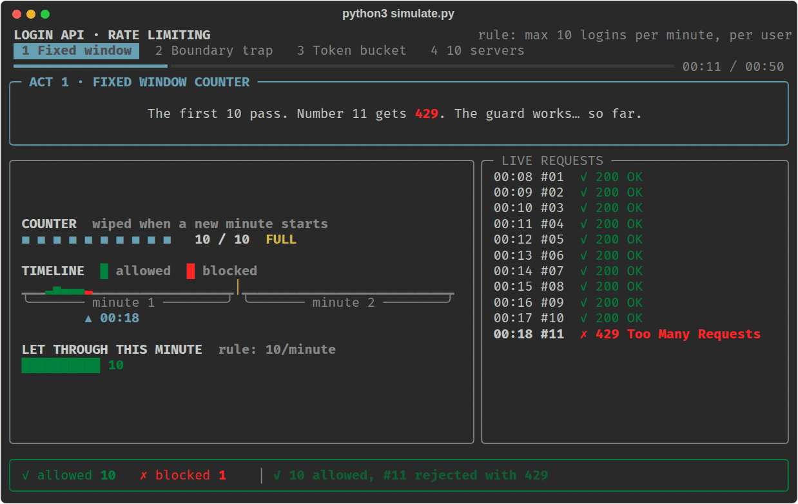

### Act 2: the boundary trap

Same limiter, smarter attacker. They wait for 00:59 and fire 10 logins. All pass and the counter is full.

Then the clock reaches 01:00. A new minute starts and the counter is wiped back to 0:

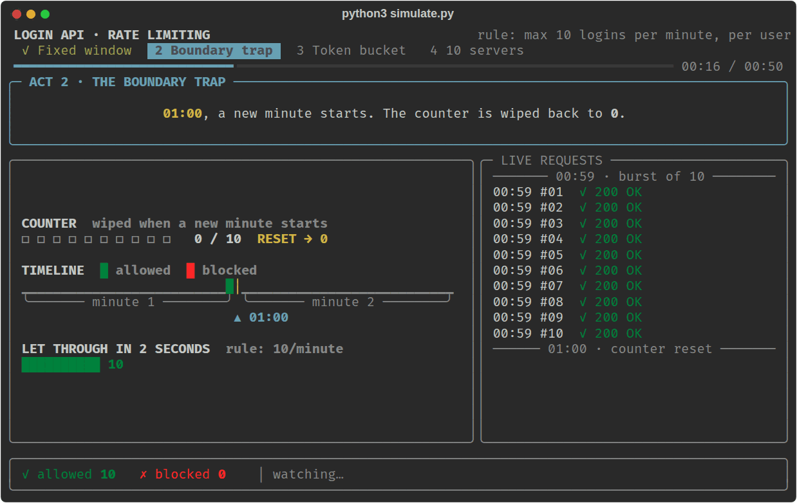

At 01:01 the attacker fires 10 more, and all of those pass too. On the timeline you can see the two bursts sitting on either side of the boundary line. The bar at the bottom turns red for everything past the limit: **20 logins in 2 seconds**.

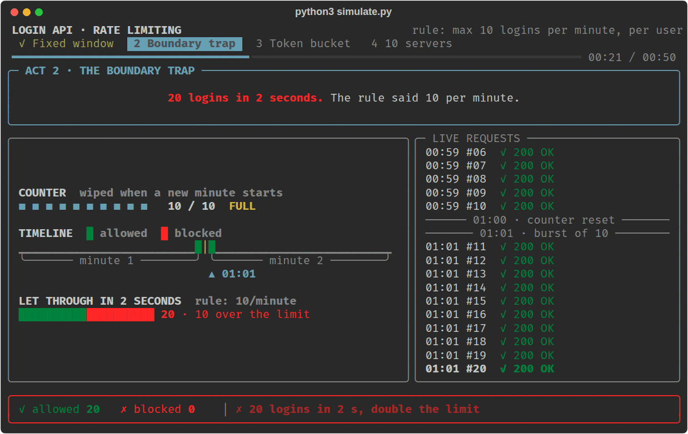

### Act 3: the token bucket faces the same attack

The limiter is swapped for a token bucket holding 10 tokens, drawn as balls. Each login that finds a ball takes it out and passes. A new ball drips in every 6 seconds (10 per minute).

The first burst at 00:59 drains the bucket. Here login #06 has just taken a ball, and 4 are left:

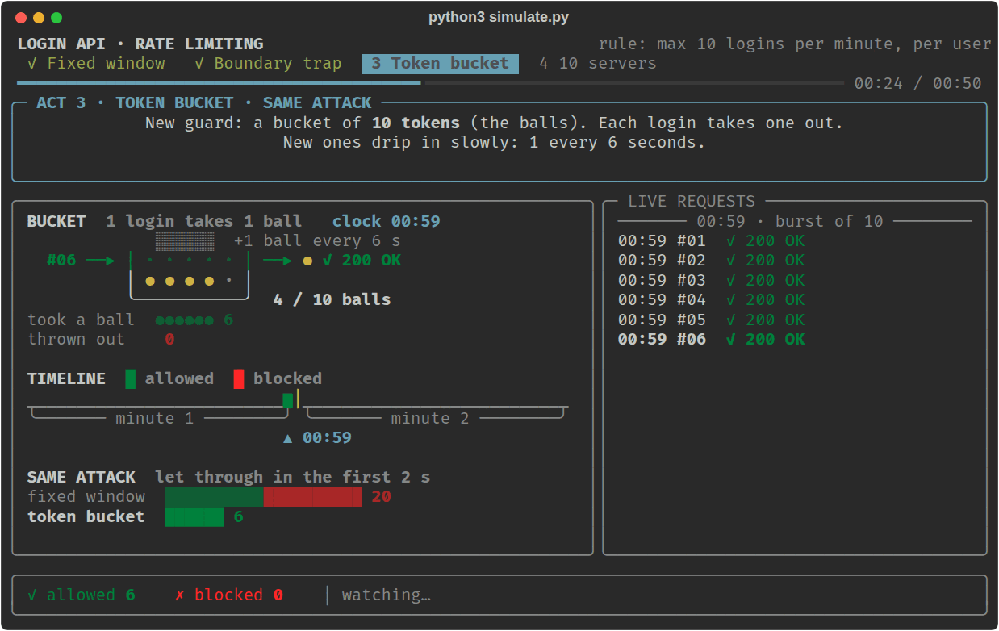

At 01:01 the attacker fires the second burst. This is where the fixed window gave away another 10. The bucket has had only 2 seconds of refill, which is a third of a ball, so it is still empty and every login is thrown out:

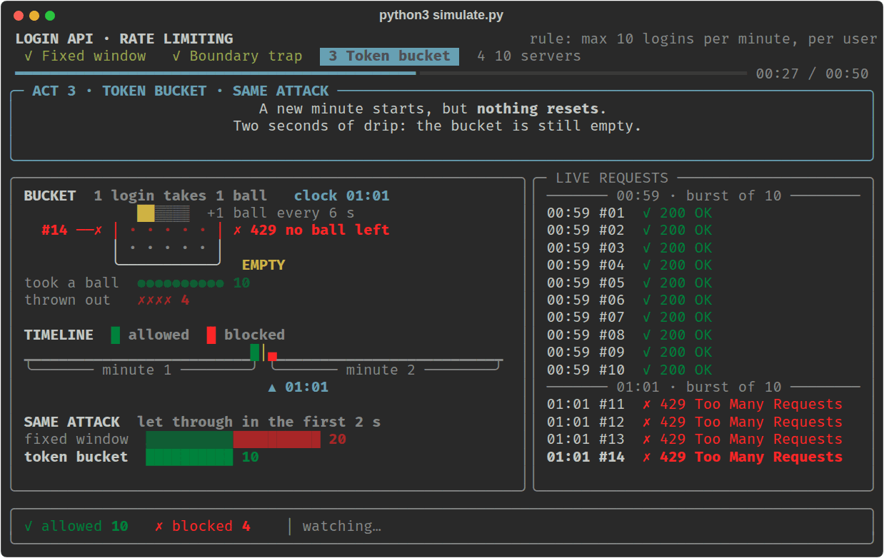

The attacker keeps trying once a second for 12 more seconds. Only 2 logins get through, at 01:05 and 01:11, the moments a new ball lands. The comparison at the bottom tells the story: the same attack got 20 past the fixed window and 10 past the token bucket.

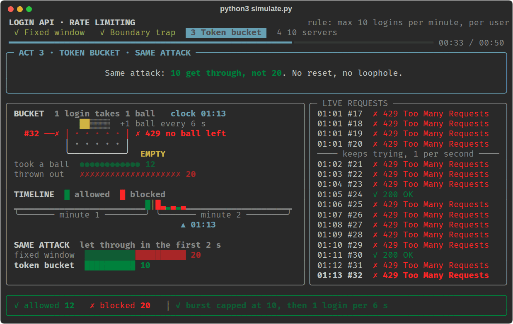

### Act 4: ten servers

First, each of the 10 servers keeps its own counter. The attacker sends 30 logins and the load balancer hands them out in turn. Every server sees only 3, which is far below its limit of 10, so every server says yes. Together they allow **30**.

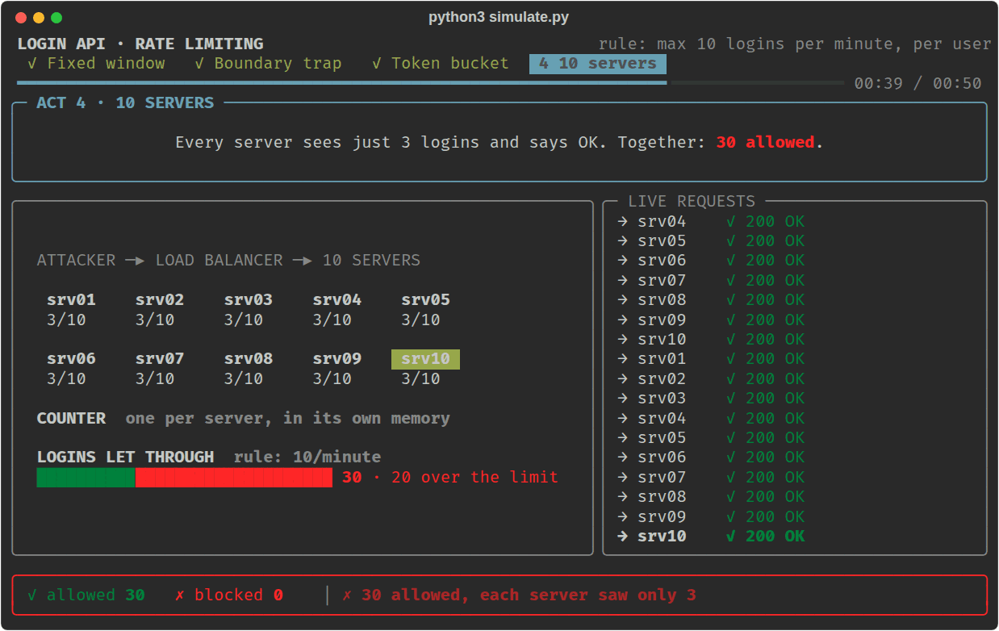

Then all servers read and write one counter in Redis. The same 30 logins arrive the same way. The first 10 fill the shared counter and the other 20 are rejected, no matter which server they reach.

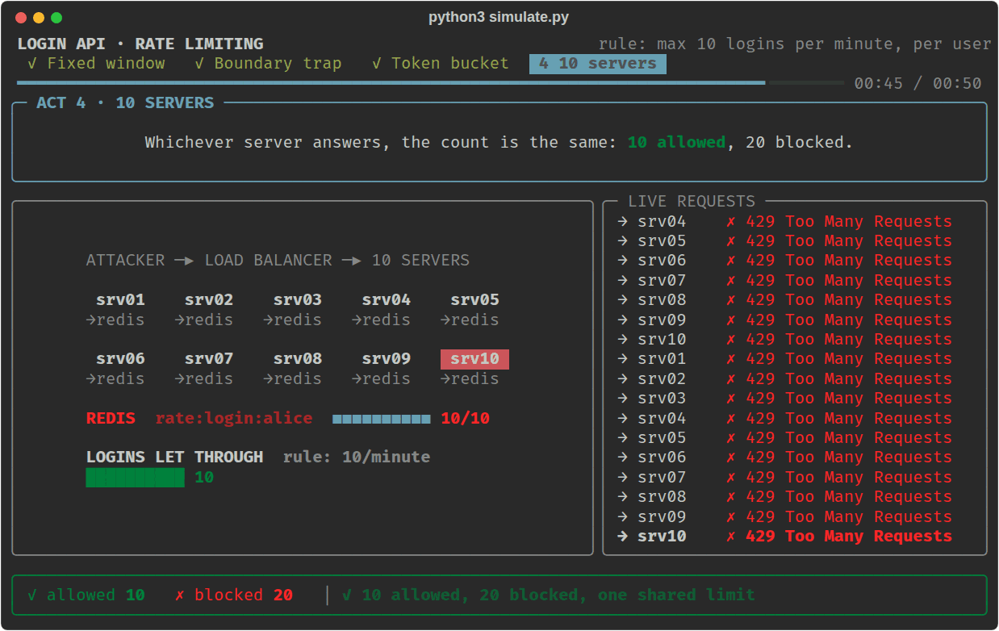

### The summary after each act

When an act finishes, the show stops on a summary: the result, a moment-by-moment table of what happened, and three short notes on why. It waits there until you press Enter.

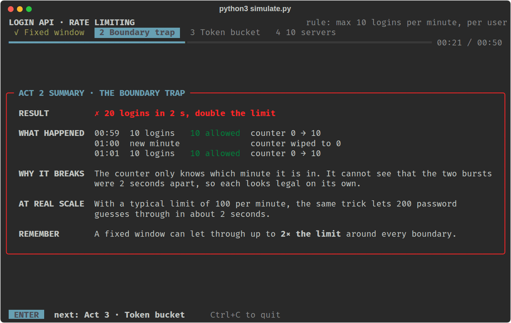

### The final scoreboard

The last screen puts all five results in one table. It stays in your terminal after the show exits. It is the image at the top of this page.

## Options

```bash
python3 simulate.py              # full show, press Enter between acts
python3 simulate.py --auto       # no stops, plays straight through (about 50 s)
python3 simulate.py 2 3          # only acts 2 and 3
python3 simulate.py --speed 0.5  # half speed; 2 is twice as fast
```

- Press **Ctrl+C** at any time to quit.
- To change the pacing for good, edit `PACE` near the top of `simulate.py`. It stretches every pause in the show; `1.0` is the original speed and the current value is `1.25`.
- A taller terminal (about 30 rows or more) also shows the timeline in act 3.
- If the output is piped instead of shown in a terminal, the script prints only the final scoreboard.

## What the simulation simplifies

- **The limit is 10 per minute, not 100,** so each request is visible. At 100 per minute the boundary trap lets 200 logins through.
- **The clock is simulated.** The show jumps to 00:59 instead of making you wait a minute.
- **There is no real Redis.** "Shared Redis" in act 4 is a single limiter object that all ten simulated servers use, which is the property that matters. A real deployment would also have to make each update atomic.
- **Act 4 uses fixed window counters** in both halves. The point of that act is where the state lives, and it applies equally to a token bucket.
- **The load balancer is plain round-robin** and there is one attacker targeting one user.

## The interview answer

If you are asked **"How would you prevent brute-force login attempts?"**:

> I would rate limit the login API per user. I would use a token bucket: every login attempt takes a token, and tokens are refilled at a fixed rate. If the bucket is empty I reject the request with HTTP 429. I prefer this to a fixed window counter because a fixed window resets all at once, which lets a user send double the limit around the boundary. Since the application runs on several servers, I would keep the bucket state in shared Redis instead of each server's memory, so the limit holds no matter which server handles the request.

| Term | Meaning |
|---|---|
| Rate limiter | Controls how many requests a user can make |
| HTTP 429 | The response that says "too many requests" |
| Fixed window | A counter that resets at fixed intervals |
| Boundary problem | The burst a fixed window allows across a reset |
| Token bucket | Tokens spent per request and refilled at a steady rate |
| Redis | Shared, in-memory storage for limiter state across servers |
| TTL | Automatic expiry of state nobody is using |
| Brute force | Repeated password guesses to break into an account |

## Files

| File | What it holds |
|---|---|
| `simulate.py` | The simulation: both limiters, the four acts, and all the drawing |
| `notes.md` | Short revision notes on the same ideas |
| `images/` | The screenshots on this page |
