# Cache and database synchronization

An online store keeps product prices in a database and a fast copy of them in a cache. When a price changes, how do you make sure the cache does not keep showing the old one? This project explains the standard rule, shows the race condition that beats it, and lets you watch two fixes side by side in a terminal.

The short version:

- The basic rule is **update the database first, then delete the cache key**.
- That rule has a hole: a slow reader can put the **old value back into the cache** after the delete, and it stays there.
- A **TTL** (expiry time) limits how long the stale value is served. It does not stop the stale write.
- A **lease token** stops it: the cache refuses a write from a reader whose permission was cancelled by the delete.

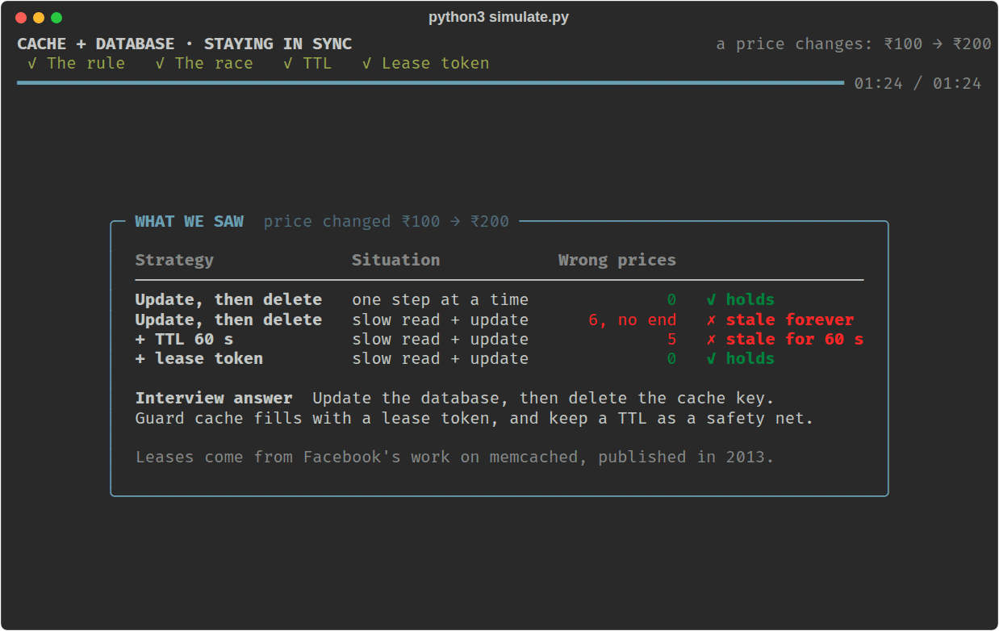

## Contents

- [Run the simulation](#run-the-simulation)
- [Why there is a cache at all](#why-there-is-a-cache-at-all)
- [Reading: the cache miss flow](#reading-the-cache-miss-flow)
- [Writing: update the database, then delete the key](#writing-update-the-database-then-delete-the-key)
- [The race condition](#the-race-condition)
- [Fix 1: TTL](#fix-1-ttl)
- [Fix 2: lease tokens](#fix-2-lease-tokens)
- [Side by side](#side-by-side)
- [The simulation, screen by screen](#the-simulation-screen-by-screen)
- [Options](#options)
- [What the simulation simplifies](#what-the-simulation-simplifies)
- [The interview answer](#the-interview-answer)
- [Files](#files)

## Run the simulation

```bash
pip install rich
python3 simulate.py
```

You need Python 3 (tested on 3.12) and a terminal of at least 80 columns by 24 rows.

It opens by asking how you want to watch — one step at a time, or playing itself at normal, slow or fast speed. Whichever you pick, the show plays four acts and stops on a summary after each one until you press Enter.

## Why there is a cache at all

The database is the source of truth, but asking it is slow compared with reading from memory. A cache is a fast copy of answers the database has already given. Most requests can be served from the copy, and the database is only asked when the copy is missing.

The cost is that there are now two places holding the same fact. The whole problem in this project is keeping them in agreement.

## Reading: the cache miss flow

A request looks in the cache first. If the value is there, that is a **cache hit** and the request is done. If it is not, that is a **cache miss**, and the request does the slow thing once and saves the result for everyone after it:

```text
Request
   ↓
Check cache
   ↓
Cache miss
   ↓
Fetch latest data from DB
   ↓
Set data in cache
   ↓
Return data
```

For a product price:

1. The request checks the cache.
2. The cache does not contain the price.
3. The request queries the database.
4. The latest price comes back.
5. The request stores the price in the cache.
6. The price is returned to the user.

This pattern is commonly called **cache-aside**. Notice that steps 3 and 5 are separate moments. Between them, the request is holding a value that nobody else knows about. That gap is where the trouble comes from.

## Writing: update the database, then delete the key

The rule for a change is:

1. **Update the database first.**
2. **Then delete the corresponding key from the cache.**

```text
Update DB
   ↓
Delete cache key
```

After the delete, the next reader gets a miss, fetches the new value from the database, and puts it in the cache. The cache heals itself through the normal read path.

Two details explain why the rule is written this way:

- **Delete, do not overwrite.** Deleting is safe to repeat and never writes a wrong value. Writing the new value into the cache directly would add a second place where two concurrent updates can land in the wrong order.
- **Database first.** If the key were deleted first, a reader could arrive before the database update, miss, read the old value and cache it, and the delete would already be over.

## The race condition

The rule works when steps happen one at a time. It can fail when a read and a write overlap.

Take a product that costs **₹100**, with nothing in the cache yet.

**Step 1. User A asks for the price.** The cache is empty, so User A gets a miss and reads ₹100 from the database. User A has not written it to the cache yet.

**Step 2. An admin changes the price.** The database goes from ₹100 to ₹200, and the admin's request deletes the cache key, exactly as the rule says. But the key is already missing, because User A's miss is the reason it is being loaded in the first place. The delete removes nothing.

**Step 3. User A writes the old value.** User A's request continues with the ₹100 it fetched earlier and stores it in the cache.

```text
User A                         Admin

Cache miss
   |
   |---- Fetch ₹100 from DB
   |
   |                         Update DB → ₹200
   |                         Delete cache key   (nothing there)
   |
   |---- Set cache → ₹100
   |
   ↓
Cache contains stale ₹100
```

Now the two disagree:

```text
Database: ₹200
Cache:    ₹100   ← stale
```

Every later request is a cache hit and is shown ₹100. Nothing will correct it: the delete has already happened, and nobody is going to delete the key again until the next price change.

The window is small, since it needs the read to land before the update and the cache write to land after the delete. A busy system gives it many chances.

## Fix 1: TTL

The simplest answer is to give every cache entry a **TTL (time to live)**. After that long, the entry removes itself.

```text
Cache: ₹100
TTL:   60 seconds
```

This puts a ceiling on the damage. The stale ₹100 can be served for at most 60 seconds, after which the next reader misses and reloads ₹200.

It does not prevent the problem. The stale write still happens, and for the length of the TTL every customer sees the wrong price. Making the TTL shorter reduces the staleness but sends more requests to the database, which is the thing the cache was meant to avoid.

In an interview, TTL is treated as the basic answer. It is worth having as a safety net, and the interviewer will expect something stronger.

## Fix 2: lease tokens

A lease changes what a cache miss means. A miss no longer just says "not here". It also hands the reader a **lease token**: permission to fill this key.

```text
Cache miss
   ↓
Get lease token
   ↓
Fetch data from DB
   ↓
Before setting the cache:
   is the lease still valid?
   ↓
Valid   → set cache
Invalid → do NOT set cache
```

Two rules make it work:

1. A write is accepted only if it carries the key's current token.
2. **Deleting the key cancels the token**, even when the key is empty.

Run the same story again:

- **User A** gets a miss and lease #1, reads ₹100 from the database, and stalls.
- **The admin** updates the database to ₹200 and deletes the key. The key is empty, but this time the delete cancels lease #1.
- **User A** comes back with ₹100 and lease #1. The cache checks the token, finds it cancelled, and refuses the write.
- The cache stays empty. **The next reader** gets a fresh lease, reads ₹200, and its write is accepted.

In the race, the admin's delete had no effect because there was nothing to delete. With leases, the delete always leaves a mark: it invalidates whatever read was in flight.

This is the cache used in act 4, as the simulation runs it (docstring trimmed):

```python
class LeaseCache(Cache):
    def __init__(self) -> None:
        super().__init__()
        self.leases: dict[str, int] = {}
        self.issued = 0

    def get_or_lease(self, key: str, now: float) -> tuple[int | None, int | None]:
        value = self.get(key, now)
        if value is not None:
            return value, None
        self.issued += 1
        self.leases[key] = self.issued
        return None, self.issued

    def set_with_lease(self, key: str, value: int, token: int, now: float) -> bool:
        if self.leases.get(key) != token:
            return False
        del self.leases[key]
        self.set(key, value, now)
        return True

    def delete(self, key: str) -> bool:
        self.leases.pop(key, None)
        return super().delete(key)
```

**Where it comes from.** Facebook described leases for its memcached deployment in the 2013 paper *Scaling Memcache at Facebook*. There the token is tied to the key the reader asked for, and the cache server invalidates it when it receives a delete for that key. The same mechanism is also used there to stop many readers from hitting the database at once for one missing key, which this project does not cover.

## Side by side

| Approach | What it does | Limitation |
|---|---|---|
| Delete the key after a DB update | Forces the next reader to reload the new value | A concurrent cache miss can put the old value back |
| TTL | Removes every entry after a fixed time | The stale value is still served until it expires |
| Lease token | Lets a reader fill the cache only while its lease is valid | The cache has to track and check tokens |

```text
TTL:    "Eventually remove the stale value."
Lease:  "Prevent an outdated request from writing the stale value."
```

## The simulation, screen by screen

`simulate.py` runs a small database and cache through the same price change four times. Every result on screen comes from that code: the cache really is empty when the admin deletes, and the lease check really does refuse the write.

One product starts at ₹100 and the admin changes it to ₹200.

### The screen

- **Top:** the price change, which of the four acts is playing, and a progress bar.
- **Caption:** one or two sentences saying what is happening right now.
- **Left panel:** the database and the cache next to each other. The cache box turns green when it matches the database and red when it is stale. Under it is **In flight**, the request that has started but not finished, and what it is holding. Below that is the count of customers shown the right and the wrong price.
- **Right panel:** every step in the order it really happened. User A is cyan and the admin is purple.
- **Bottom:** the running score, and a verdict when the act ends.

### Intro: the setup

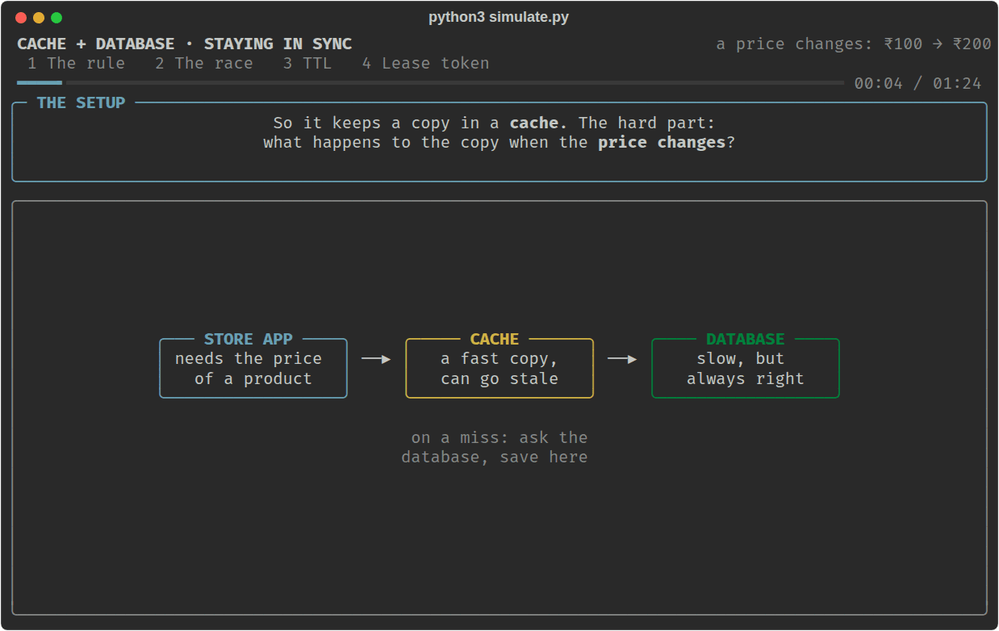

### Act 1: the rule, with no overlap

Customer 1 misses, reads ₹100 from the database and fills the cache. Customers 2 and 3 are served from the cache without touching the database.

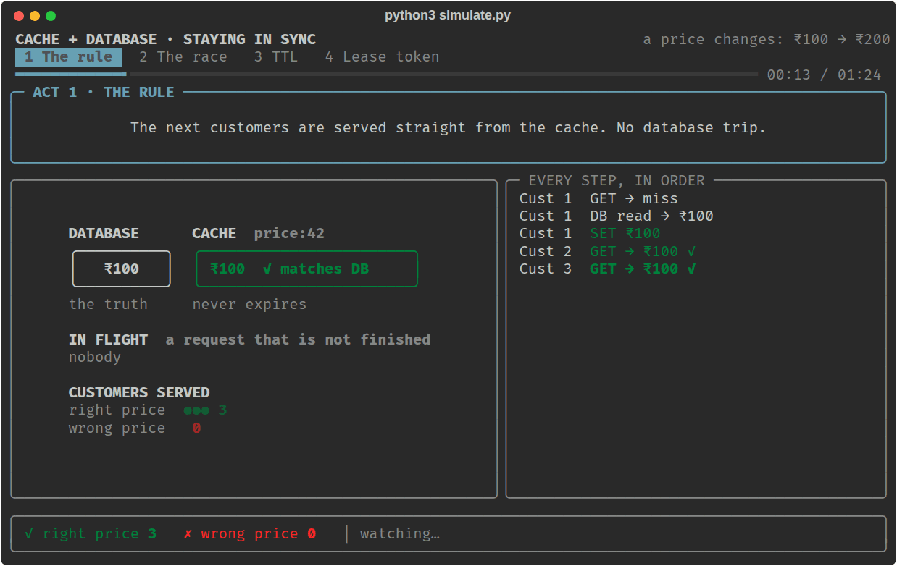

Then the admin sets the price to ₹200 and deletes the key. Customer 4 misses, reloads ₹200 and refills the cache, and customers 5 and 6 hit it. All six saw the right price.

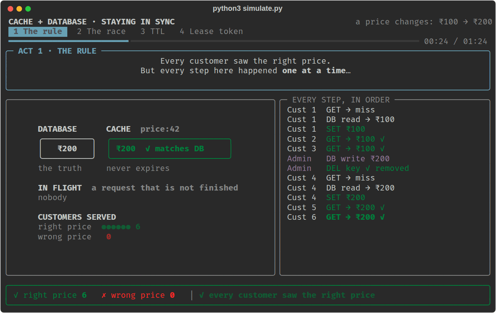

### Act 2: the race

User A misses and reads ₹100, then stalls before saving it. The admin updates the database to ₹200 and deletes the key. Look at the log line: the key was already empty, so the delete did nothing. User A is still holding ₹100, now marked out of date.

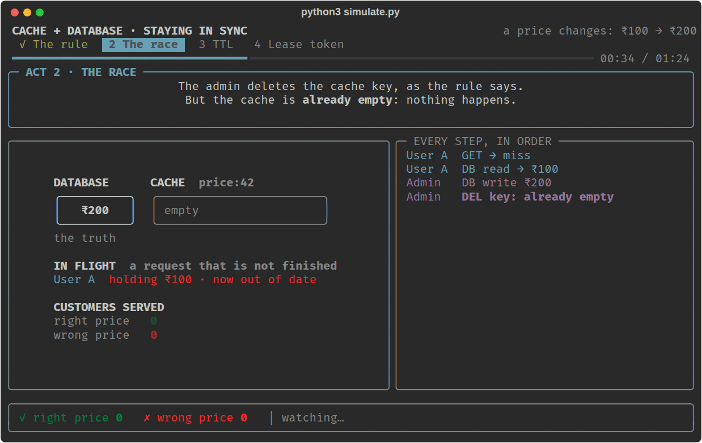

User A wakes up and saves its ₹100. The cache box turns red: it says ₹100 while the database says ₹200.

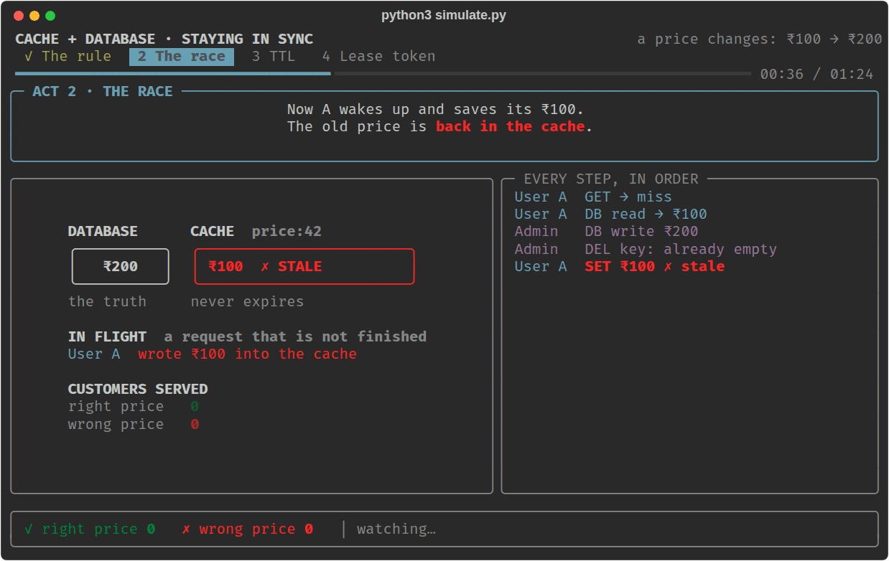

Six customers arrive and all six are shown ₹100. The entry never expires, so this continues until the next price change.

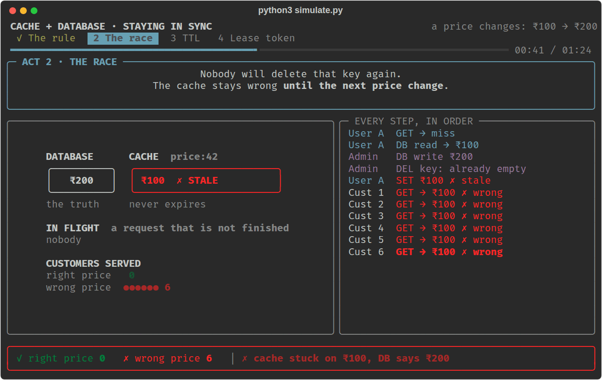

### Act 3: TTL

The same race plays out, but the stale entry is written with a 60 second TTL. Customers arrive every 10 seconds. The line under the cache box counts down while each of them is shown the old price.

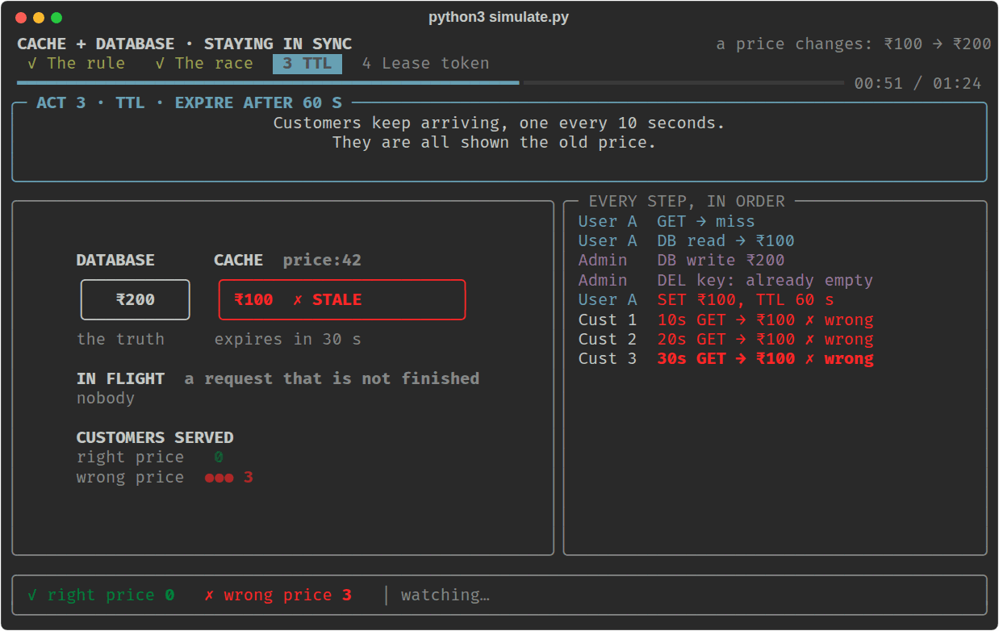

At 60 seconds the entry expires. The next customer misses, reloads ₹200, and the cache is correct again. Five customers saw the wrong price before that happened.

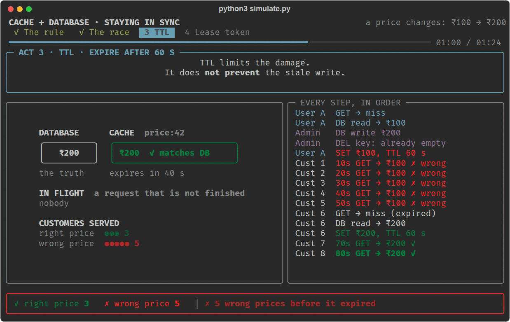

### Act 4: lease token

User A misses and receives lease #1, reads ₹100 and stalls. The admin updates the database and deletes the key. The key is empty, but the delete cancels lease #1, shown under the cache box.

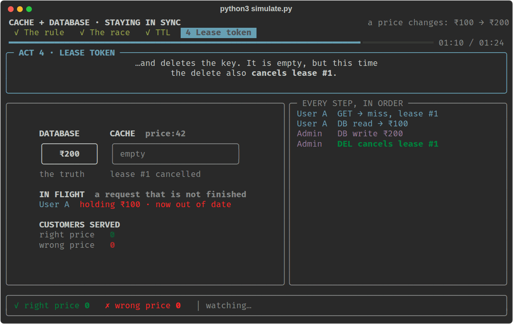

User A wakes up and tries to save ₹100 with lease #1. The cache refuses, and stays empty.

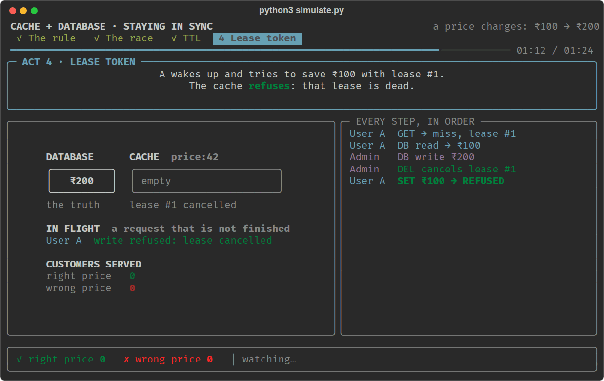

Customer 1 then misses, gets lease #2, reads ₹200, and that write is accepted. Everyone is shown ₹200. No customer saw a wrong price.

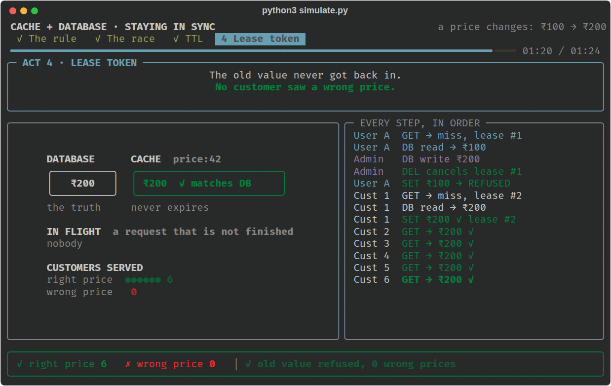

### The summary after each act

When an act ends, the show stops on a summary: the result, a table of what happened, and three short notes on why. It waits until you press Enter.

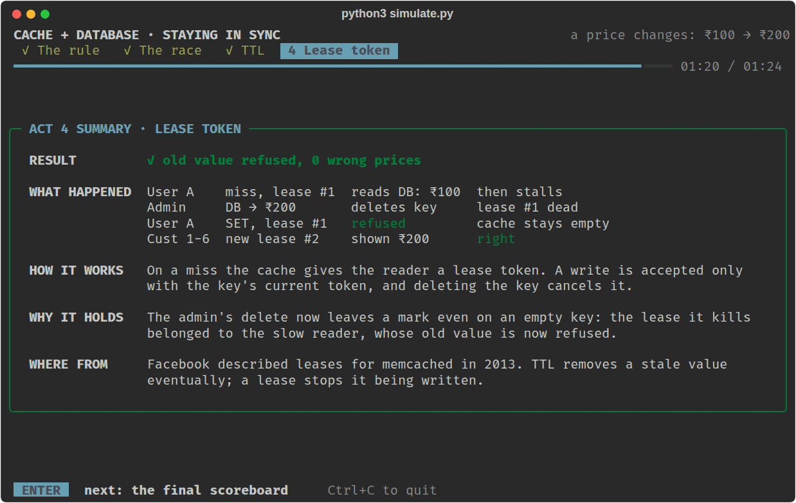

### The final scoreboard

The last screen compares the four runs in one table and stays in your terminal after the show exits. It is the image at the top of this page.

## Options

Run it with no arguments and it asks how you want to watch:

```text
 1  Step by step  every step waits for Enter    61 steps
 2  Normal        plays itself                about 01:24
 3  Slow          half speed                  about 02:48
 4  Fast          double speed                about 00:42
```

Press 1 to 4, or Enter to take Normal. Every mode stops on a summary after each
act, so you choose the pace of the playing, not of the reading.

The menu can be skipped from the command line:

```bash
python3 simulate.py --step       # step by step
python3 simulate.py --speed 0.5  # a speed of your own; 2 is twice as fast
python3 simulate.py 2 4          # only acts 2 and 4
python3 simulate.py --auto       # no menu and no stops, start to finish
```

- Press **Ctrl+C** at any time to quit.
- To change the pacing for good, edit `PACE` near the top of `simulate.py`. It stretches every pause; `1.0` is the default.
- If the output is piped instead of shown in a terminal, the script prints only the final scoreboard.

## What the simulation simplifies

- **The overlap is scripted.** There are no real threads. The acts run the steps in the exact order that produces the race, so you see it every time. In a real system the same order happens by chance.
- **The cache and database are small Python objects,** not Redis, memcached or a real database.
- **Time is simulated.** The 60 seconds of act 3 pass in a few seconds on screen.
- **User A's own answer is not scored.** User A is shown ₹100, which was the price when it asked. The score counts the customers who arrive after the change.
- **The lease cache is minimal.** It has one token per key and no lease expiry, and it leaves out the part of Facebook's design that makes other readers wait while one of them holds the lease.

## The interview answer

If you are asked **"How do you keep a cache in sync with the database?"**:

> I update the database first and then delete the cache key, so the next reader reloads the fresh value. On its own that has a race: a reader that missed the cache and read the old value just before the update can write it back after my delete, and the cache stays stale. A TTL bounds how long that lasts, but it does not prevent it. To prevent it I would use lease tokens, as Facebook did for memcached: the cache hands a token to the reader on a miss, the delete invalidates that token, and the cache rejects a set that carries an invalid token.

| Term | Meaning |
|---|---|
| Cache hit / miss | The value was, or was not, in the cache |
| Cache-aside | Read the cache; on a miss read the database and fill the cache |
| Invalidation | Removing a cache entry because the data behind it changed |
| Stale data | A cached value that no longer matches the database |
| Race condition | A wrong result caused by the order two overlapping requests happen in |
| TTL | Time after which a cache entry removes itself |
| Lease token | Permission, given on a miss, to fill one cache key; cancelled by a delete |

## Files

| File | What it holds |
|---|---|
| `simulate.py` | The simulation: the database, both caches, the four acts, and all the drawing |
| `notes.md` | Short revision notes on the same ideas |
| `images/` | The screenshots on this page |
