# Free trial abuse prevention

A service gives everyone one free trial. Nothing stops a person from signing up again with a new email address. This project shows why the obvious defences fail, and how real fraud systems answer the question instead: not *is this the same person?* but *how likely is this signup to be abuse?*

The short version:

- **One trial per IP address** blocks whole offices and households, and misses anyone who switches to a mobile hotspot.
- **Device fingerprinting** is better, but it is a guess about a browser, and changing browser changes the answer.
- A **risk score** adds up several weak signals. No single one proves anything; together they are hard to beat cheaply.
- The middle of the score is where honest people get hurt, so **challenge** it instead of denying it.

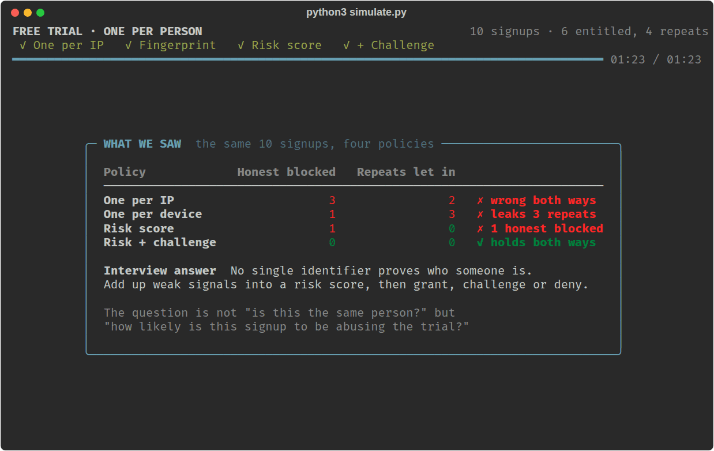

## Contents

- [Run the simulation](#run-the-simulation)
- [The problem](#the-problem)
- [One trial per IP address](#one-trial-per-ip-address)
- [Device fingerprinting](#device-fingerprinting)
- [The risk score](#the-risk-score)
- [The challenge band](#the-challenge-band)
- [Side by side](#side-by-side)
- [The simulation, screen by screen](#the-simulation-screen-by-screen)
- [Options](#options)
- [What the simulation simplifies](#what-the-simulation-simplifies)
- [The interview answer](#the-interview-answer)
- [Files](#files)

## Run the simulation

```bash
pip install rich
python3 simulate.py
```

You need Python 3 (tested on 3.12) and a terminal of at least 80 columns by 24 rows.

It opens by asking how you want to watch — one step at a time, or playing itself at normal, slow or fast speed. Whichever you pick, the show plays four acts and stops on a summary after each one until you press Enter.

## The problem

A free trial is worth something, so people will try to take it twice. Creating a second account costs nothing: a new email address takes seconds, and there are services that hand out disposable ones.

So the service has to decide, at signup, whether this is a new person or someone who already had their turn. Every policy that tries to answer that has two ways to be wrong:

- **Too strict** and honest people are turned away. They never had a trial, and the service just refused a paying customer.
- **Too loose** and the same person keeps coming back for free.

The simulation keeps score of both at once, because a policy that fixes one by making the other worse has not actually helped.

## One trial per IP address

The first idea is to remember the IP address of every trial and refuse a second one from the same address.

It fails in both directions.

**It blocks honest people.** One public IP address is not one person. It is shared by:

- a household
- an office
- a university
- a hotel
- an entire mobile network, where carrier-grade NAT puts thousands of phones behind one address

In the simulation, Rahul signs up from the office and gets a trial. Sneha and Arjun sit in the same room, and the rule refuses them a trial they never had. The same happens to Vikram, who lives with Priya.

**It misses abuse.** An IP address is easy to change: mobile data, a hotspot, a VPN, or simply waiting for the home router to pick up a new address. The repeat visitor in the simulation is blocked twice on their home broadband, then switches to a phone hotspot and is granted a trial twice more.

An IP address is a real signal. It is just not proof, so it should never be the whole rule.

## Device fingerprinting

The second idea looks at the device instead. A fingerprint is a hash of what the browser reveals about itself:

- browser and version
- operating system
- screen size
- language
- time zone
- installed fonts, canvas rendering, and other details

This is a genuine improvement. The office trio have three different machines, so all three get their trial. The rule also catches the repeat visitor's second attempt from the same browser.

But a fingerprint describes a browser, not a person:

- **It changes when the person changes anything.** Another browser, another device, a private window, cleared storage, or an anti-fingerprinting extension all produce a new hash. In the simulation, opening a second browser on the same machine is enough to look like a new device.
- **It collides for different people.** Two people sharing one laptop at home produce the same fingerprint, so Vikram is blocked because Priya used that laptop. Freshly imaged corporate machines can hash alike too.

Fingerprinting should raise suspicion, not deliver a verdict.

## The risk score

The change in thinking is to stop looking for one perfect identifier. Instead, collect many weak signals, give each a weight, and add up the ones that fire.

These are the signals the simulation uses and what each is worth:

| Points | Signal | Why it matters |
|---:|---|---|
| 45 | The payment method already used a trial | Hardest thing to get a fresh one of |
| 40 | The device already used a trial | Strong, but a new browser resets it |
| 25 | Three or more signups from this network range in an hour | Catches a run of attempts even when each IP is new |
| 20 | The email address was created today | Normal for some people, common for all abusers |
| 15 | The IP address already used a trial | Weak on its own: offices and households share one |
| 15 | Behaves like accounts that abused trials before | Timing, typing, the order fields get filled |

The total is capped at 100. Anything from 40 up is treated as suspicious.

This works because of what it costs to beat. Beating any one signal is cheap. Beating all of them at once means a different device, a different network and a different payment method, every single time.

In the simulation the scores come out like this:

| Signup | Score | Why |
|---|---:|---|
| Priya, Rahul | 0 | Nothing fired |
| Sneha, Arjun | 15 | Office IP already used a trial |
| free2 | 100 | Same device, same card, same IP, fresh email |
| free3 | 100 | New browser, but same card, same IP, a run of signups |
| free4 | 90 | New device and IP, same card, same network range |
| free5 | 60 | Everything new, but still fast, fresh and familiar |
| Vikram | 55 | Priya's laptop and Priya's home IP |

Every repeat signup is now stopped, including free5, who changed device, network and card. But look at the bottom row. Vikram scored 55 for the crime of living with Priya, and a hard deny gives him no way out. The score is better at spotting abuse, and still turning away an honest customer.

## The challenge band

The last change is to stop treating "unsure" as "no". A score in the middle means the service does not know, so it should ask rather than decide:

| Risk | Response |
|---|---|
| Under 40 | Grant the trial, no friction |
| 40 to 69 | Challenge: ask the signup to prove something |
| 70 and over | Deny |

A good challenge is cheap for an honest person and expensive for an abuser. Verifying a payment method fits: a second email address or browser profile is free, but a payment method that has not already claimed a trial is not. Other options are an SMS code to a phone number, or an existing account in good standing.

Both borderline cases in the simulation land in this band and come out differently:

- **Vikram** (55) is asked for a card. He has his own, it verifies, and he gets his trial.
- **free5** (60) is asked for a card. The prepaid one is declined, and the trial is refused.

The service never had to decide whether Vikram was really a new person. It asked him a question that was easy for him to answer and hard for an abuser.

Payment methods are not proof either. Families share cards, companies use one corporate card, and privacy-preserving payment services exist. That is exactly why a card belongs in a score and in a challenge, and not in a rule of its own.

## Side by side

| Policy | Honest people blocked | Repeat signups let in |
|---|---:|---:|
| One trial per IP | 3 | 2 |
| One trial per device | 1 | 3 |
| Risk score, deny at 40 | 1 | 0 |
| Risk score + challenge | 0 | 0 |

The question is not "is this definitely the same person?" but "how likely is this signup to be abusing the free trial?" — and then a response that fits the answer.

## The simulation, screen by screen

`simulate.py` sends the same ten signups past four policies. Every decision on screen is the real return value of the policy's code, scored against who each signup really is.

Five honest people sign up: Priya, Rahul, Sneha, Arjun and Vikram. One more person signs up five times, as `free1` to `free5`. Their first trial is fair, so six of the ten signups are entitled to one and four are repeats. A repeat is marked **↺** on screen, but no policy ever sees that mark: it is only used to score the decisions.

### The screen

- **Top:** the four acts, and a progress bar.
- **Caption:** one or two sentences about what is happening right now.
- **Left panel:** the rule in force, the signup being looked at, what the policy knows about it, and the decision. Anything that matches a previous trial is shown in red.
- **Right panel:** every decision in order. Honest handles are blue, repeats are purple.
- **Bottom:** the two error counts, and a verdict when the act ends.

### Intro: the problem

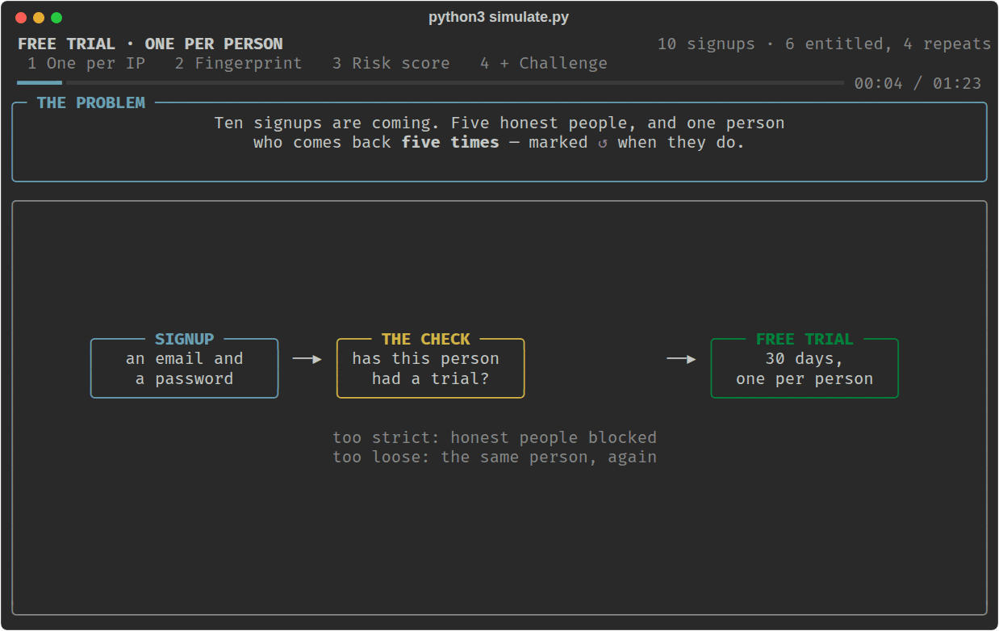

### Act 1: one trial per IP address

Rahul signs up from the office and gets a trial. Sneha is next, from the same office, and the rule refuses her. She has never had a trial.

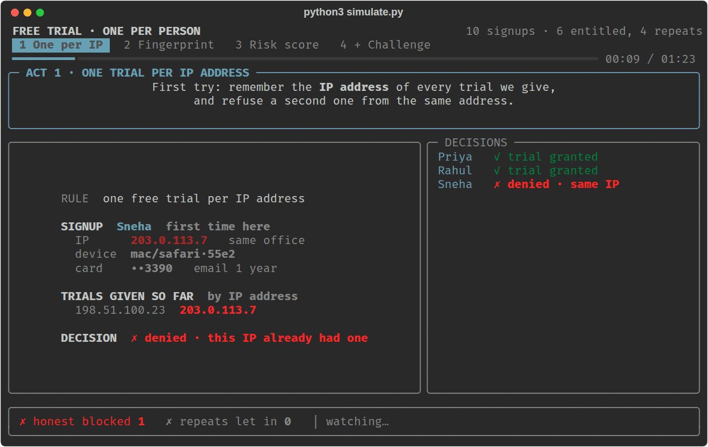

The repeat visitor is blocked twice on their home line, so they switch to a mobile hotspot. The IP has never been seen, so the rule has nothing to match on and hands over another trial.

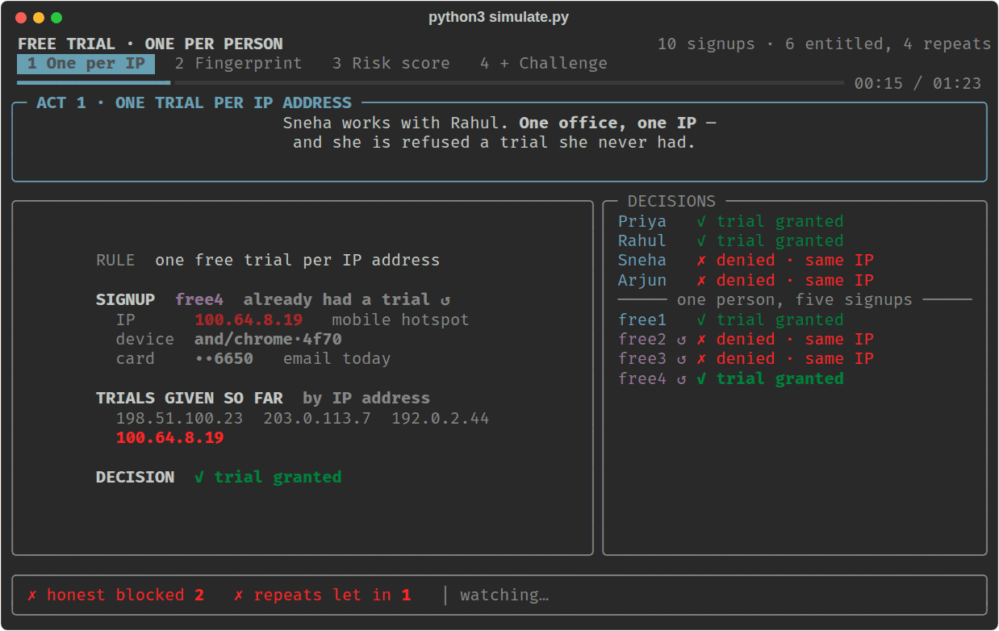

By the end, three honest people have been blocked and two repeats have been let in.

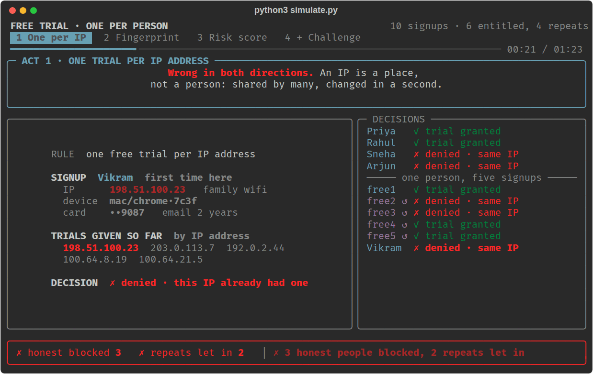

### Act 2: device fingerprint

The office is fixed straight away. Three colleagues, three different machines, three trials.

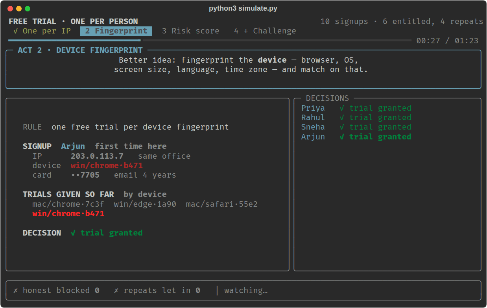

Then the repeat visitor opens a different browser on the same computer. New fingerprint, new device as far as the rule can tell, and another trial.

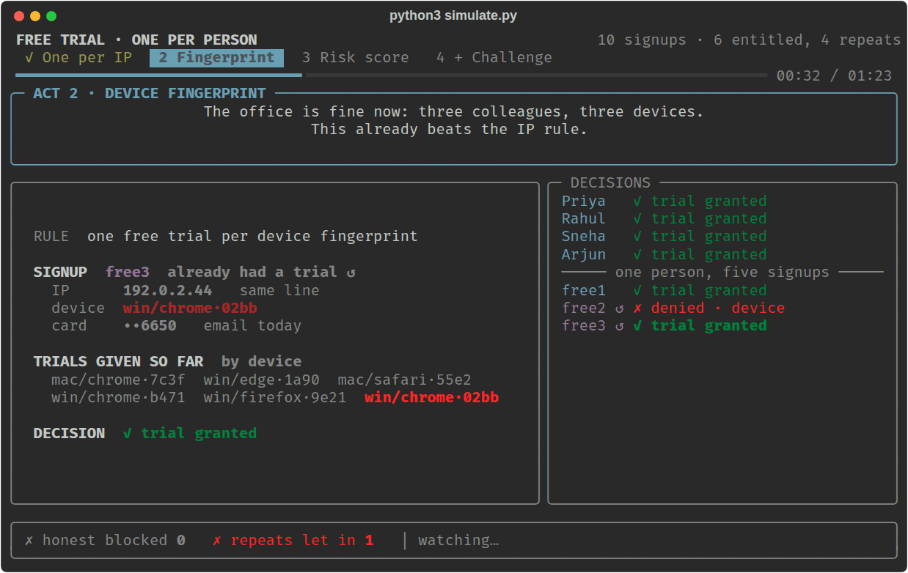

### Act 3: risk score

Now each signal adds points. The repeat visitor's second attempt trips four at once and maxes out the score.

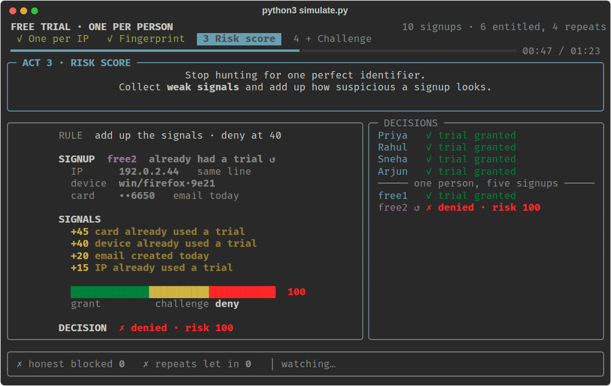

Their last attempt is more careful: new device, new IP, new card. It still reaches 60, from the run of signups on that network range, the fresh email, and behaviour that matches past abuse.

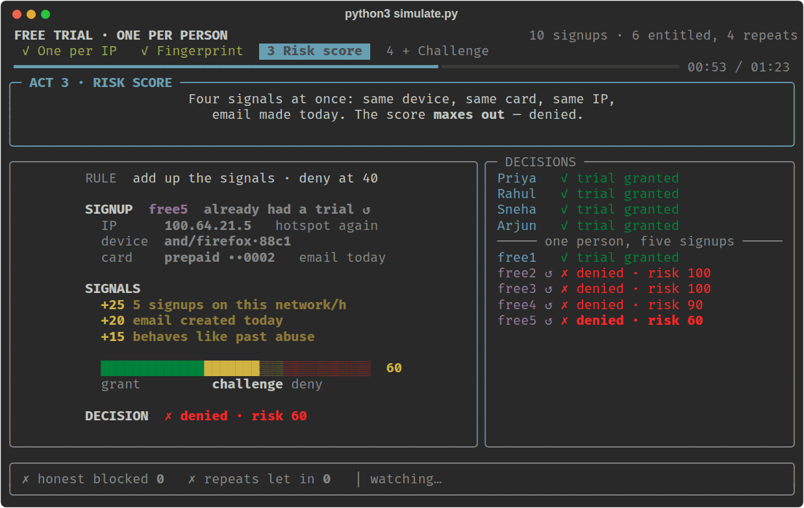

But the same score refuses Vikram at 55, for using the family laptop on the family wifi.

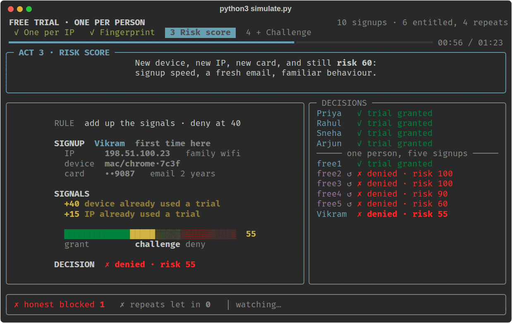

The summary after the act lays out what the score fixed and what it did not.

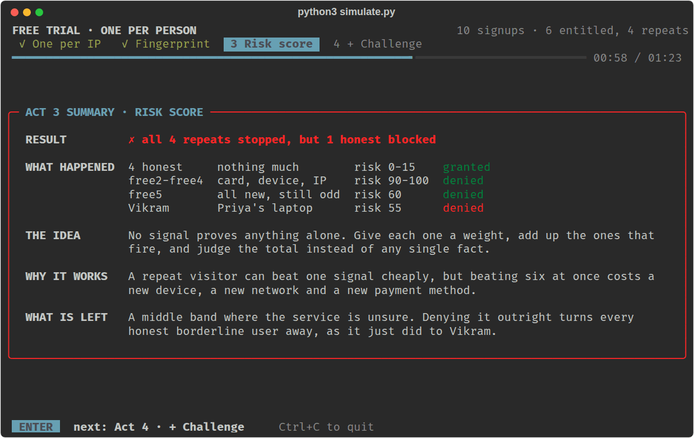

### Act 4: risk score and a challenge

Scores of 40 to 69 are no longer denied. They are asked to verify a payment method. The prepaid card is declined, so the trial is refused.

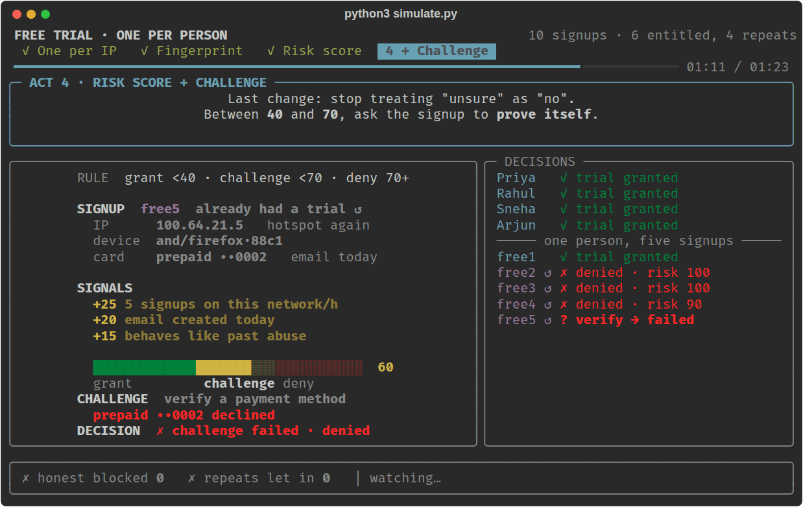

Vikram is asked the same question. His own card verifies, and he gets his trial. Nobody honest was turned away and no repeat got through.

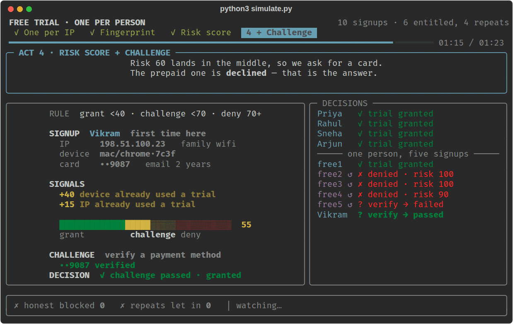

### The final scoreboard

The last screen compares all four policies and stays in your terminal after the show exits. It is the image at the top of this page.

## Options

Run it with no arguments and it asks how you want to watch:

```text
 1  Step by step  ENTER forward, ← back      121 steps
 2  Normal        plays itself             about 01:23
 3  Slow          half speed               about 02:46
 4  Fast          double speed             about 00:41
```

Press 1 to 4, or Enter to take Normal. Every mode stops on a summary after each
act, so you choose the pace of the playing, not of the reading.

**Step by step** moves on with Enter and goes back with **←**, **Backspace** or
**Shift+Enter**. Going back replays pictures that were already drawn, so you can
walk over a moment as often as you like, including back out of an act summary
into the act it describes. Shift+Enter only reaches the program in terminals
that report modifier keys — kitty, Ghostty, WezTerm and foot among them.
Everywhere else Shift+Enter sends exactly what Enter sends, which is why ← and
Backspace do the same job.

The menu can be skipped from the command line:

```bash
python3 simulate.py --step       # step by step
python3 simulate.py --speed 0.5  # a speed of your own; 2 is twice as fast
python3 simulate.py 1 3          # only acts 1 and 3
python3 simulate.py --auto       # no menu and no stops, start to finish
```

- Press **Ctrl+C** at any time to quit.
- To change the pacing for good, edit `PACE` near the top of `simulate.py`. It stretches every pause; `1.0` is the default.
- A terminal of about 30 rows or more shows every signal that fired; at 24 rows the list is trimmed to fit.
- If the output is piped instead of shown in a terminal, the script prints only the final scoreboard.

## What the simulation simplifies

- **The weights are invented.** Real systems learn them from labelled outcomes, usually with a model, and retune them constantly. The numbers here were chosen to make each failure visible.
- **Ground truth is known.** The simulation knows who the repeat visitor is, so it can score the policies. A real service never finds out for certain, which is the entire difficulty.
- **The signals are handed to the code.** Things like "signups from this network in the last hour", "email created today" and "behaves like past abuse" arrive as fields on the signup instead of being computed from traffic.
- **Office colleagues sign up hours apart,** so they never trip the velocity signal. In production a team signing up together would, which is why velocity needs care.
- **One challenge, one outcome.** A real service offers a few routes through a challenge, retries, and reviews appeals by hand.
- **Prepaid cards are refused outright here.** Real services vary: some decline prepaid and virtual cards for trials, others accept them and lean on other signals.

## The interview answer

If you are asked **"How would you stop people abusing your free trial?"**:

> I would not look for a single identifier, because none of them works. An IP address is shared by an office or a mobile network, and a device fingerprint changes as soon as someone opens another browser. Instead I would score each signup on several weak signals: the device, the payment method, the IP and its network range, how fast accounts are being created, how old the email address is, and how the account behaves. Then I would act in proportion to the score: grant the trial when it is low, deny it when it is high, and in the middle challenge the user, for example by verifying a payment method. The goal is not to prove it is the same person. It is to estimate how likely abuse is, and to make the response fit that estimate.

| Term | Meaning |
|---|---|
| Device fingerprint | A hash of what a browser reveals about itself |
| Carrier-grade NAT | Many mobile customers sharing one public IP address |
| Velocity | How many signups come from one identity or network in a window |
| Risk score | Weak signals, weighted and added up |
| Challenge | Asking a suspicious user to prove something cheap for them, costly for an abuser |
| False positive | An honest user treated as an abuser |
| False negative | An abuser treated as honest |

## Files

| File | What it holds |
|---|---|
| `simulate.py` | The simulation: the ten signups, the four policies, and all the drawing |
| `notes.md` | Short revision notes on the same ideas |
| `images/` | The screenshots on this page |
